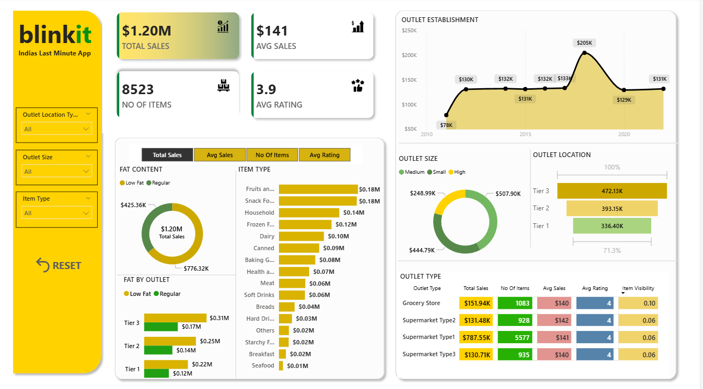

# BLINKIT-DASHBOARD

# 🛒 Blinkit Sales Analytics Dashboard (Power BI)

A dynamic and interactive **Power BI dashboard** built to analyze Blinkit’s sales performance, customer preferences, outlet distribution, and product trends. This project transforms raw sales data into meaningful business insights using powerful visualizations and analytics.

---

# 📌 Project Overview

The **Blinkit Sales Dashboard** helps analyze and monitor key business metrics such as:

- Total Sales Performance
- Product Category Analysis
- Outlet Performance
- Customer Ratings
- Fat Content Distribution
- Location-Based Sales Trends

The dashboard enables businesses to make **data-driven decisions** by identifying sales patterns, high-performing products, and profitable outlet types.

---

# 🛠️ Tech Stack

The dashboard was built using the following tools and technologies:

| Technology | Purpose |
|------------|---------|
| 📊 Power BI Desktop | Data visualization and dashboard creation |
| 📂 Power Query | Data cleaning and transformation |
| 🧠 DAX (Data Analysis Expressions) | Calculated measures and KPIs |
| 📝 Data Modeling | Creating relationships between tables |
| 📁 File Formats | `.pbix` for dashboard and `.png` for preview |

---

# 📂 Data Source

The dataset used in this project contains Blinkit sales-related information, including:

- Product Categories (Fruits, Snacks, Dairy, etc.)
- Outlet Types and Sizes
- Outlet Location Tiers (Tier 1, Tier 2, Tier 3)
- Sales and Revenue Data
- Customer Ratings
- Item Details and Visibility

> **Note:** The dataset is used for educational and analytical purposes only.

---

# 📊 Dashboard Walkthrough

## 🔹 Key Performance Indicators (KPIs)

The top section of the dashboard highlights the primary business metrics:

| KPI | Value |
|-----|-------|
| 💰 Total Sales | $1.20M |
| 📦 Number of Items | 8523 |
| 📈 Average Sales | $141 |
| ⭐ Average Rating | 3.9 |

---

## 🏪 Outlet Establishment Trend

### 📈 Line Chart Analysis
- Shows sales trends across different years
- Helps identify outlet growth patterns
- Tracks business expansion performance over time

### Key Insight
- Sales peaked around 2018 with strong outlet establishment growth.

---

## 📦 Sales by Item Type

### 📊 Bar Chart Analysis
Displays sales contribution from different product categories.

### Top Performing Categories
- Fruits & Vegetables
- Snack Foods
- Household Items
- Frozen Foods

### Business Value
Helps identify high-demand products for better inventory planning.

---

## 🥗 Fat Content Analysis

### 🍩 Donut Chart Analysis
Compares sales between:
- Low Fat Products
- Regular Products

### Key Insight
- Regular fat products contribute slightly higher overall sales.

---

## 📍 Outlet Location Analysis

### 📊 Tier-wise Sales Distribution
Analyzes sales across:
- Tier 1
- Tier 2
- Tier 3 Cities

### Key Insight
- Tier 3 outlets generated the highest sales.

### Business Impact
Supports location-based expansion strategies.

---

## 🏬 Outlet Size Analysis

### 🍩 Donut Chart Analysis
Compares sales across:
- Small Outlets
- Medium Outlets
- High-Sized Outlets

### Key Insight
- Medium-sized outlets contribute the highest revenue.

---

## 🛒 Outlet Type Performance

### 📋 Comparative Table Analysis
Compares:
- Grocery Stores
- Supermarket Type 1
- Supermarket Type 2
- Supermarket Type 3

### Metrics Included
- Total Sales
- Average Sales
- Number of Items
- Ratings
- Item Visibility

### Key Insight
- Grocery Stores show strong average sales performance.

---

# 📈 Business Insights & Impact

## 📊 Sales Optimization
Identifies top-performing products to improve inventory management and maximize revenue.

## 🏪 Outlet Strategy
Helps businesses determine which outlet types and sizes perform best.

## 📍 Location Intelligence
Shows strong sales opportunities in Tier 3 locations.

## 🛒 Customer Preference Analysis
Provides insights into product demand and purchasing behavior.

---

# 📷 Dashboard Preview



---

# 🚀 Features

✅ Interactive Filters & Slicers  
✅ Dynamic KPI Cards  
✅ Sales Trend Analysis  
✅ Product Performance Tracking  
✅ Outlet Comparison Analysis  
✅ User-Friendly Visual Design  

---

# 📂 Project Structure

```bash
Blinkit-Sales-Dashboard/
│
├── Blinkit-Sales-Dashboard.pbix
├── Blinkit-Sales-Dashboard.png
├── dataset/
│   └── blinkit_sales_data.csv
└── README.md
```

---

# 🔮 Future Improvements

- Add Sales Forecasting
- Real-Time Data Integration
- Customer Segmentation Analysis
- Profit & Loss Dashboard
- Mobile-Responsive Design

---

# 👨‍💻 Author

## Kiran Tapare


---

# ⭐ Support

If you found this project useful, give it a ⭐ on GitHub and share your feedback!


